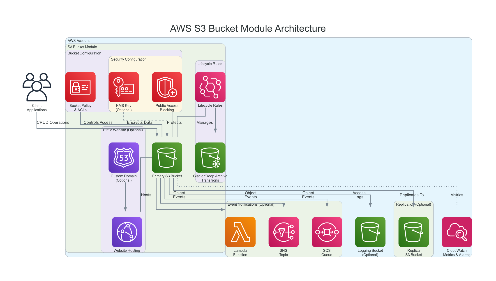

# AWS S3 Bucket Module

This module creates and configures an S3 bucket with various optional features including:

- Server-side encryption using AWS KMS keys
- Bucket versioning
- Lifecycle rules for object transitions and expiration
- Access control through bucket policies and ACLs
- Public access blocking
- Logging configuration
- Website hosting configuration
- Cross-region replication
- Event notifications (Lambda, SNS, SQS)

The module follows AWS best practices & CIS Best Practice Benchmark for S3 bucket security and management.

Use terraform-docs to generate the full documentation:

```bash
terraform-docs --config .docs/.terraform-docs.yml .
```

<!-- BEGIN_TF_DOCS -->

## Diagram:



## Example:

```hcl
#Example: Basic S3 Bucket Creation with versioning and access logging

resource "random_id" "basic_suffix" {
  byte_length = 4
}

resource "random_id" "logging_suffix" {
  byte_length = 4
}

# Create a bucket for logging
module "logging_s3" {
  source        = "../"
  bucket_name   = "logging-bucket-${random_id.logging_suffix.hex}"
  force_destroy = true

  # Make this a logging bucket
  is_logging_bucket = true

  # Enable versioning with MFA delete disabled
  versioning = {
    enabled    = true
    mfa_delete = false
  }

  tags = {
    Environment = "dev"
    Purpose     = "Example"
  }
}


module "basic_s3" {
  source        = "../"
  bucket_name   = "basic-bucket-${random_id.basic_suffix.hex}"
  force_destroy = true

  #Configure access logging to a separate logging bucket
  logging = {
    target_bucket = module.logging_s3.bucket_id
    target_prefix = "s3-access-logs/basic-bucket-${random_id.basic_suffix.hex}/"
  }

  tags = {
    Environment = "dev"
    Purpose     = "Example"
  }
}

output "basic_s3_id" {
  description = "The ID of the S3 Basic bucket."
  value       = module.basic_s3.bucket_id
}

output "logging_s3_id" {
  description = "The ID of the S3 Logging bucket."
  value       = module.logging_s3.bucket_id
}
```


## Inputs

| Name | Description | Type | Default | Required |
|------|-------------|------|---------|:--------:|
| <a name="input_bucket_name"></a> [bucket\_name](#input\_bucket\_name) | The name of the S3 bucket. Must be globally unique. | `string` | n/a | yes |
| <a name="input_create_kms_key"></a> [create\_kms\_key](#input\_create\_kms\_key) | If true, create a customer managed KMS key for S3 bucket encryption. | `bool` | `false` | no |
| <a name="input_encryption"></a> [encryption](#input\_encryption) | Server-side encryption configuration. If using a customer managed KMS key, this will be set automatically. | <pre>object({<br>    sse_algorithm     = string<br>    kms_master_key_id = optional(string)<br>  })</pre> | `null` | no |
| <a name="input_force_destroy"></a> [force\_destroy](#input\_force\_destroy) | A boolean that indicates all objects should be deleted from the bucket so that the bucket can be destroyed without error. WARNING: This will delete all objects in the bucket. | `bool` | `false` | no |
| <a name="input_is_logging_bucket"></a> [is\_logging\_bucket](#input\_is\_logging\_bucket) | Indicates if the bucket is used for logging. If true, the bucket will be created with a logging S3 bucket policy. | `bool` | `false` | no |
| <a name="input_kms_key_alias"></a> [kms\_key\_alias](#input\_kms\_key\_alias) | Alias for the customer managed KMS key (if created). | `string` | `null` | no |
| <a name="input_kms_key_description"></a> [kms\_key\_description](#input\_kms\_key\_description) | Description for the customer managed KMS key (if created). | `string` | `"KMS key for S3 bucket encryption"` | no |
| <a name="input_lifecycle_rules"></a> [lifecycle\_rules](#input\_lifecycle\_rules) | A list of lifecycle rules for objects in the bucket. | <pre>list(object({<br>    id      = optional(string)<br>    enabled = optional(bool, true)<br>    prefix  = optional(string)<br>    tags    = optional(map(string))<br>    transitions = optional(list(object({<br>      days          = number<br>      storage_class = string<br>    })), [])<br>    expiration = optional(list(object({<br>      days = number<br>    })), [])<br>  }))</pre> | `[]` | no |
| <a name="input_logging"></a> [logging](#input\_logging) | Bucket access logging configuration. When enabled, logs will be delivered to the specified target bucket with the provided prefix. | <pre>object({<br>    target_bucket = string<br>    target_prefix = optional(string, "")<br>  })</pre> | `null` | no |
| <a name="input_notifications"></a> [notifications](#input\_notifications) | Notification configuration for S3 events. | <pre>object({<br>    lambda_functions = optional(list(object({<br>      arn           = string<br>      events        = list(string)<br>      filter_prefix = optional(string)<br>      filter_suffix = optional(string)<br>    })), [])<br>    topics = optional(list(object({<br>      arn           = string<br>      events        = list(string)<br>      filter_prefix = optional(string)<br>      filter_suffix = optional(string)<br>    })), [])<br>    queues = optional(list(object({<br>      arn           = string<br>      events        = list(string)<br>      filter_prefix = optional(string)<br>      filter_suffix = optional(string)<br>    })), [])<br>  })</pre> | `null` | no |
| <a name="input_policy"></a> [policy](#input\_policy) | A valid bucket policy JSON document. | `string` | `null` | no |
| <a name="input_public_access_block"></a> [public\_access\_block](#input\_public\_access\_block) | Public access block configuration. | <pre>object({<br>    block_public_acls       = optional(bool, true)<br>    block_public_policy     = optional(bool, true)<br>    ignore_public_acls      = optional(bool, true)<br>    restrict_public_buckets = optional(bool, true)<br>  })</pre> | `null` | no |
| <a name="input_replication"></a> [replication](#input\_replication) | Replication configuration. | <pre>object({<br>    role = string<br>    rule = object({<br>      id     = string<br>      status = string<br>      prefix = optional(string)<br>      destination = object({<br>        bucket        = string<br>        storage_class = optional(string)<br>      })<br>    })<br>  })</pre> | `null` | no |
| <a name="input_tags"></a> [tags](#input\_tags) | A map of tags to assign to the bucket. | `map(string)` | `{}` | no |
| <a name="input_versioning"></a> [versioning](#input\_versioning) | Versioning configuration for the bucket. | <pre>object({<br>    enabled    = bool<br>    mfa_delete = optional(bool, false)<br>  })</pre> | <pre>{<br>  "enabled": false,<br>  "mfa_delete": false<br>}</pre> | no |
| <a name="input_website"></a> [website](#input\_website) | Static website hosting configuration. | <pre>object({<br>    index_document = string<br>    error_document = optional(string)<br>  })</pre> | `null` | no |
## Outputs

| Name | Description |
|------|-------------|
| <a name="output_bucket_arn"></a> [bucket\_arn](#output\_bucket\_arn) | The ARN of the bucket. |
| <a name="output_bucket_domain_name"></a> [bucket\_domain\_name](#output\_bucket\_domain\_name) | The bucket domain name. |
| <a name="output_bucket_id"></a> [bucket\_id](#output\_bucket\_id) | The name of the bucket. |
| <a name="output_bucket_regional_domain_name"></a> [bucket\_regional\_domain\_name](#output\_bucket\_regional\_domain\_name) | The regional domain name of the bucket. |
| <a name="output_versioning"></a> [versioning](#output\_versioning) | The versioning state of the bucket. |
| <a name="output_website_endpoint"></a> [website\_endpoint](#output\_website\_endpoint) | The website endpoint, if static website hosting is enabled. |
## Resources

| Name | Type |
|------|------|
| [aws_kms_alias.this](https://registry.terraform.io/providers/hashicorp/aws/latest/docs/resources/kms_alias) | resource |
| [aws_kms_key.this](https://registry.terraform.io/providers/hashicorp/aws/latest/docs/resources/kms_key) | resource |
| [aws_s3_bucket.this](https://registry.terraform.io/providers/hashicorp/aws/latest/docs/resources/s3_bucket) | resource |
| [aws_s3_bucket_lifecycle_configuration.this](https://registry.terraform.io/providers/hashicorp/aws/latest/docs/resources/s3_bucket_lifecycle_configuration) | resource |
| [aws_s3_bucket_logging.this](https://registry.terraform.io/providers/hashicorp/aws/latest/docs/resources/s3_bucket_logging) | resource |
| [aws_s3_bucket_notification.this](https://registry.terraform.io/providers/hashicorp/aws/latest/docs/resources/s3_bucket_notification) | resource |
| [aws_s3_bucket_policy.bucket_policy](https://registry.terraform.io/providers/hashicorp/aws/latest/docs/resources/s3_bucket_policy) | resource |
| [aws_s3_bucket_public_access_block.this](https://registry.terraform.io/providers/hashicorp/aws/latest/docs/resources/s3_bucket_public_access_block) | resource |
| [aws_s3_bucket_replication_configuration.this](https://registry.terraform.io/providers/hashicorp/aws/latest/docs/resources/s3_bucket_replication_configuration) | resource |
| [aws_s3_bucket_server_side_encryption_configuration.this](https://registry.terraform.io/providers/hashicorp/aws/latest/docs/resources/s3_bucket_server_side_encryption_configuration) | resource |
| [aws_s3_bucket_versioning.this](https://registry.terraform.io/providers/hashicorp/aws/latest/docs/resources/s3_bucket_versioning) | resource |
| [aws_s3_bucket_website_configuration.this](https://registry.terraform.io/providers/hashicorp/aws/latest/docs/resources/s3_bucket_website_configuration) | resource |
| [aws_caller_identity.current](https://registry.terraform.io/providers/hashicorp/aws/latest/docs/data-sources/caller_identity) | data source |
| [aws_iam_policy_document.base_policy](https://registry.terraform.io/providers/hashicorp/aws/latest/docs/data-sources/iam_policy_document) | data source |
| [aws_iam_policy_document.combined_policy](https://registry.terraform.io/providers/hashicorp/aws/latest/docs/data-sources/iam_policy_document) | data source |
| [aws_iam_policy_document.logging](https://registry.terraform.io/providers/hashicorp/aws/latest/docs/data-sources/iam_policy_document) | data source |
| [aws_iam_policy_document.website](https://registry.terraform.io/providers/hashicorp/aws/latest/docs/data-sources/iam_policy_document) | data source |
<!-- END_TF_DOCS -->
